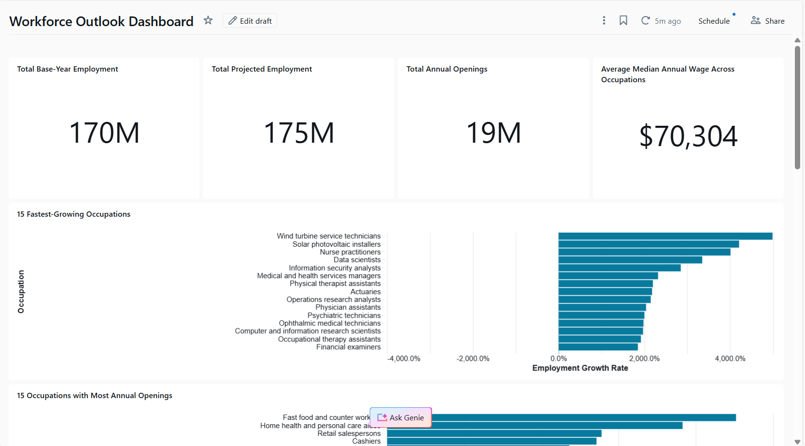
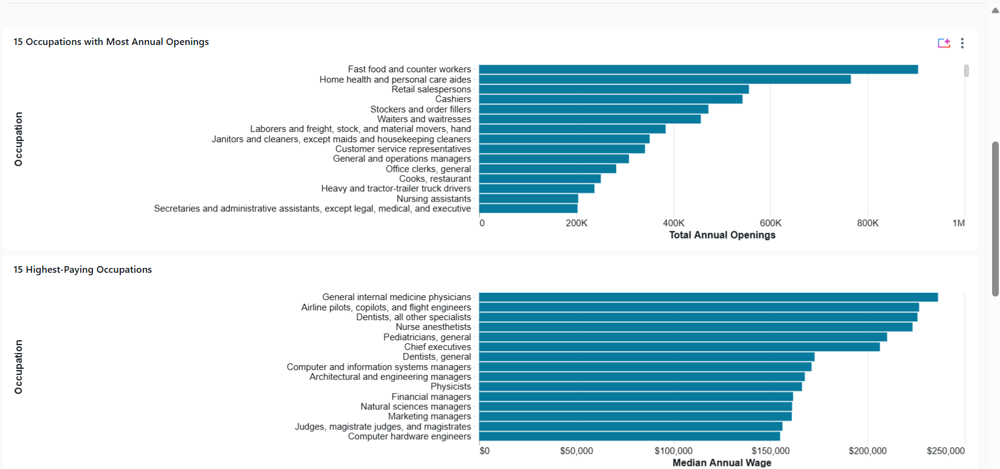
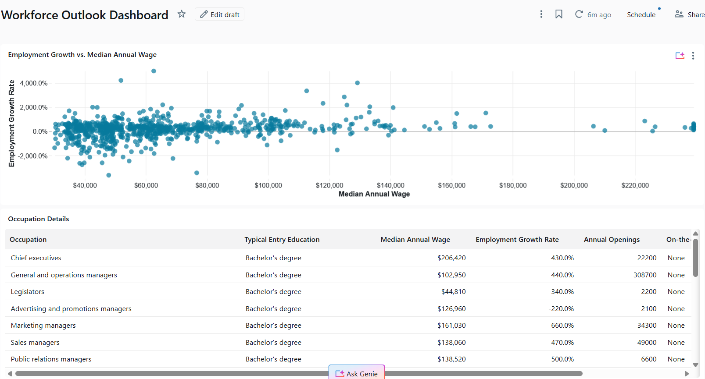

# Workforce Analytics Lakehouse

This project builds a Workforce Analytics Lakehouse using Databricks Free Edition, Unity Catalog, Databricks-managed storage, Python, and Delta Lake.

The **Bronze, Silver, and initial Gold layers are implemented**. Bronze preserves raw source files, Silver uses PySpark to clean and validate the data into managed Delta tables, and Gold provides analytics-ready views for workforce reporting. A Databricks AI/BI Workforce Outlook dashboard has also been created from the Gold layer.

## Project Goal

The goal of this project is to collect workforce analytics data from public labor market sources and transform it into reliable, analytics-ready datasets for occupation, wage, employment, growth, education, skill, and technology analysis.

The project uses:

* Bureau of Labor Statistics (BLS)
* O*NET downloadable database
* Databricks Free Edition
* Unity Catalog
* Managed Unity Catalog Volumes
* Python ingestion scripts
* GitHub version control

This project does **not** use AWS S3 directly. Databricks-managed storage is used through Unity Catalog.

---

# Architecture

The project follows a medallion architecture:

```text
Bronze  → Raw source files
Silver  → Cleaned, validated, structured tables
Gold    → Analytics-ready dashboard tables
```

The **Bronze, Silver, and initial Gold layers have been implemented**. BLS and O*NET datasets are standardized around SOC occupation codes and exposed through analytics-ready Gold views. These views support the Databricks AI/BI Workforce Outlook dashboard and future workforce analytics products.

The Bronze layer stores:

* Raw BLS API JSON files
* Raw O*NET text database files
* Raw O*NET ZIP archive
* Manifest files documenting what was downloaded

No cleaning, validation, deduplication, casting, or transformation is performed in the Bronze layer.

---

# Databricks Storage Setup

This project uses a Unity Catalog managed volume for raw Bronze files.

## Create the Catalog, Schemas, and Volume

Run this SQL in Databricks:

```sql
CREATE CATALOG IF NOT EXISTS workforce_analytics;

CREATE SCHEMA IF NOT EXISTS workforce_analytics.bronze;
CREATE SCHEMA IF NOT EXISTS workforce_analytics.silver;
CREATE SCHEMA IF NOT EXISTS workforce_analytics.gold;

CREATE VOLUME IF NOT EXISTS workforce_analytics.bronze.raw_files;
```

This creates the managed Bronze volume:

```text
/Volumes/workforce_analytics/bronze/raw_files/
```

This volume is used to store raw JSON, ZIP, and tab-delimited text files.

---

# Repository Structure

Recommended repo structure:

```text
workforce-analytics-lakehouse/
│
├── src/
│   └── bronze/
│       ├── ingest_bls_api.py
│       └── ingest_onet_text.py
│
├── data/
│   ├── bronze/
│   └── silver/
│       ├── __init__.py
│       ├── utils.py
│       ├── bls_tables.py
│       ├── onet_tables.py
│       └── data_insertion.py
│
├── sql/
│   ├── setup_unity_catalog.sql
│   └── gold/
│       ├── 01_dim_occupation.sql
│       ├── 02_fact_oews_measurement.sql
│       ├── 03_fact_occupation_projection.sql
│       ├── 04_bridge_occupation_education.sql
│       ├── 05_bridge_occupation_skill.sql
│       ├── 06_bridge_occupation_software.sql
│       ├── 07_bridge_occupation_job_zone.sql
│       └── 99_validate_gold_views.sql
│
├── dashboards/
│   └── workforce_outlook.lvdash.json
│
├── docs/
│   └── images/
│       ├── workforce_outlook_overview.png
│       ├── workforce_outlook_rankings.png
│       └── workforce_outlook_details.png
│
├── README.md
└── requirements.txt
```

---

# Bronze Layer Design

The Bronze layer is responsible for raw ingestion only.

## Bronze Rules

The Bronze layer should:

* Store source files exactly as collected
* Preserve raw JSON and text file formats
* Keep the original O*NET ZIP archive
* Store files in meaningful folders
* Create manifest files for traceability
* Avoid cleaning, validation, casting, or transformation

The Bronze layer should **not**:

* Rename columns
* Cast data types
* Remove duplicates
* Filter bad records
* Flatten nested JSON
* Convert raw files into Delta tables
* Apply business logic

Those steps belong in the Silver layer.

---

# Bronze Storage Paths

The raw files are stored in this Unity Catalog managed volume:

```text
/Volumes/workforce_analytics/bronze/raw_files/
```

The expected folder structure is:

```text
/Volumes/workforce_analytics/bronze/raw_files/
│
├── bls/
│   └── api/
│       ├── jolts_national/
│       │   ├── job_openings_level_latest.json
│       │   ├── job_openings_rate_latest.json
│       │   ├── hires_level_latest.json
│       │   ├── hires_rate_latest.json
│       │   ├── quits_level_latest.json
│       │   ├── quits_rate_latest.json
│       │   ├── layoffs_discharges_level_latest.json
│       │   ├── layoffs_discharges_rate_latest.json
│       │   ├── total_separations_level_latest.json
│       │   └── total_separations_rate_latest.json
│       │
│       ├── cps_context/
│       │   ├── unemployment_rate_latest.json
│       │   ├── labor_force_participation_rate_latest.json
│       │   ├── employment_population_ratio_latest.json
│       │   ├── civilian_labor_force_level_latest.json
│       │   ├── civilian_employment_level_latest.json
│       │   └── civilian_unemployment_level_latest.json
│       │
│       └── _manifest.json
│
└── onet/
    ├── raw_zip/
    │   └── onet_database_30_3_text.zip
    │
    ├── text_files/
    │   ├── Occupation Data.txt
    │   ├── Education Categories.txt
    │   ├── Knowledge.txt
    │   ├── Abilities.txt
    │   ├── Technology Skills.txt
    │   └── ...
    │
    └── _manifest.json
```

---

# Data Sources

## 1. Bureau of Labor Statistics API

The BLS API is used to collect labor market time-series data.

Base API URL:

```text
https://api.bls.gov/publicAPI/v2/timeseries/data/
```

The current Bronze ingestion pulls the latest available value for selected BLS series.

The BLS ingestion script saves one raw JSON file per series.

## 2. O*NET Database Text Download

The O*NET downloadable database is used for occupation, skill, education, and work requirement data.

Source ZIP file:

```text
https://www.onetcenter.org/dl_files/database/db_30_3_text.zip
```

The O*NET text download contains tab-delimited `.txt` files, not comma-separated CSV files.

The Bronze ingestion script downloads the ZIP file, stores the raw ZIP archive, extracts the `.txt` files, and saves them into the Bronze managed volume.

---

# BLS Data Collected

The BLS Bronze ingestion collects 16 total series.

## JOLTS National Labor Demand and Turnover

These series come from JOLTS, the Job Openings and Labor Turnover Survey.

| File Name                              | Series ID               | Description                           |
| -------------------------------------- | ----------------------- | ------------------------------------- |
| `job_openings_level_latest.json`       | `JTS000000000000000JOL` | National job openings level           |
| `job_openings_rate_latest.json`        | `JTS000000000000000JOR` | National job openings rate            |
| `hires_level_latest.json`              | `JTS000000000000000HIL` | National hires level                  |
| `hires_rate_latest.json`               | `JTS000000000000000HIR` | National hires rate                   |
| `quits_level_latest.json`              | `JTS000000000000000QUL` | National quits level                  |
| `quits_rate_latest.json`               | `JTS000000000000000QUR` | National quits rate                   |
| `layoffs_discharges_level_latest.json` | `JTS000000000000000LDL` | National layoffs and discharges level |
| `layoffs_discharges_rate_latest.json`  | `JTS000000000000000LDR` | National layoffs and discharges rate  |
| `total_separations_level_latest.json`  | `JTS000000000000000TSL` | National total separations level      |
| `total_separations_rate_latest.json`   | `JTS000000000000000TSR` | National total separations rate       |

These files support analysis of:

* Job openings
* Hiring activity
* Quit behavior
* Layoffs and discharges
* Total separations
* Labor demand trends

## CPS National Labor Market Context

These series come from CPS, the Current Population Survey.

| File Name                                    | Series ID     | Description                             |
| -------------------------------------------- | ------------- | --------------------------------------- |
| `unemployment_rate_latest.json`              | `LNS14000000` | National unemployment rate              |
| `labor_force_participation_rate_latest.json` | `LNS11300000` | National labor force participation rate |
| `employment_population_ratio_latest.json`    | `LNS12300000` | National employment-population ratio    |
| `civilian_labor_force_level_latest.json`     | `LNS11000000` | National civilian labor force level     |
| `civilian_employment_level_latest.json`      | `LNS12000000` | National civilian employment level      |
| `civilian_unemployment_level_latest.json`    | `LNS13000000` | National civilian unemployment level    |

These files provide macroeconomic labor market context for later dashboards and analysis.

---

# O*NET Data Collected

The O*NET Bronze ingestion downloads the full O*NET database text ZIP file.

The raw ZIP file is saved here:

```text
/Volumes/workforce_analytics/bronze/raw_files/onet/raw_zip/onet_database_30_3_text.zip
```

The extracted text files are saved here:

```text
/Volumes/workforce_analytics/bronze/raw_files/onet/text_files/
```

Important O*NET files for later Silver processing include:

| File                                      | Purpose                                           |
| ----------------------------------------- | ------------------------------------------------- |
| `Occupation Data.txt`                     | Occupation titles and SOC codes                   |
| `Education Categories.txt`                | Education level category mappings                 |
| `Education, Training, and Experience.txt` | Education, training, and experience requirements  |
| `Knowledge.txt`                           | Knowledge areas by occupation                     |
| `Abilities.txt`                           | Worker abilities by occupation                    |
| `Skills.txt` or related skills files      | Skills by occupation, depending on O*NET version  |
| `Technology Skills.txt`                   | Tools and technologies linked to occupations      |
| `Task Statements.txt`                     | Job task descriptions                             |
| `Work Activities.txt`                     | Work activity data                                |
| `Job Zones.txt`                           | Job preparation level and experience requirements |

O*NET files are tab-delimited text files. In Silver, they should be read with a tab separator:

```python
.option("sep", "\t")
```

---

# Bronze Ingestion Scripts

## 1. BLS API Ingestion

File:

```text
src/bronze/ingest_bls_api.py
```

Purpose:

* Calls the BLS API
* Pulls selected JOLTS and CPS series
* Saves raw JSON responses
* Uses meaningful file names
* Creates a manifest file
* Does not clean or validate the data

Expected output path:

```text
/Volumes/workforce_analytics/bronze/raw_files/bls/api/
```

The script saves files into:

```text
jolts_national/
cps_context/
```

It also writes:

```text
_manifest.json
```

The manifest records:

* Source name
* BLS series ID
* Description
* File name
* Raw file path
* Fetch timestamp

## 2. O*NET Text Database Ingestion

File:

```text
src/bronze/ingest_onet_text.py
```

Purpose:

* Downloads the O*NET text database ZIP
* Stores the raw ZIP archive
* Extracts the `.txt` files
* Saves the extracted files into Bronze
* Creates a manifest file
* Does not clean or validate the data

Expected output path:

```text
/Volumes/workforce_analytics/bronze/raw_files/onet/
```

The script saves:

```text
raw_zip/onet_database_30_3_text.zip
text_files/*.txt
_manifest.json
```

The manifest records:

* Source name
* Source URL
* Database version
* Raw ZIP path
* Extracted text file path
* File count
* Fetch timestamp
* Extracted file names

---

# Silver Layer Implementation

The Silver layer transforms the raw Bronze files into clean, structured, and reusable Delta tables under:

```text
workforce_analytics.silver
```

The Silver pipeline is implemented with PySpark and is organized into four main modules:

| File | Responsibility |
| --- | --- |
| `data/silver/utils.py` | Shared file readers, cleaning functions, SOC normalization, safe type casting, validation, deduplication, issue creation, and Delta writers |
| `data/silver/bls_tables.py` | Builds the BLS OEWS, Employment Projections, National Employment Matrix, and occupation crosswalk tables |
| `data/silver/onet_tables.py` | Builds O*NET occupation, education, skill, knowledge, ability, task, activity, technology, and job-zone tables |
| `data/silver/data_insertion.py` | Orchestrates the pipeline, writes managed Delta tables, and records processing audit information |

## Silver Data Sources

The Silver layer currently processes the following occupation-level sources:

* BLS Occupational Employment and Wage Statistics (OEWS)
* BLS Employment Projections
* BLS National Employment Matrix
* BLS O*NET-SOC and NEM crosswalk files
* O*NET occupation and workforce requirement text files

The BLS and O*NET datasets are standardized around SOC occupation codes so they can be joined consistently in the Gold layer.

## Data Cleaning

Reusable cleaning functions are applied consistently across BLS and O*NET datasets.

### Column Standardization

Source headers are converted to lowercase `snake_case`.

Examples:

```text
O*NET-SOC Code   → onet_soc_code
Data Value       → data_value
Employment, 2024 → employment_2024
```

The pipeline also checks for column-name collisions after normalization so two different source fields cannot silently become the same Silver column.

### String Cleaning

All string columns are trimmed to remove leading and trailing whitespace. This prevents visually identical values from being treated as different records because of hidden spaces.

### Missing-Value Standardization

Source placeholders such as the following are converted to actual Spark null values:

```text
""
-
—
N/A
NA
null
```

Missing values are not automatically replaced with zero because zero may be a valid workforce metric.

### Safe Type Casting

Source files are initially loaded as strings. Numeric fields are then converted to appropriate Spark types such as:

```text
int
double
boolean
```

The pipeline uses SQL `try_cast` rather than strict casting. Invalid values become null and are written to the centralized data-quality table instead of stopping the entire pipeline.

Currency symbols, commas, and percentage symbols are removed before numeric conversion when appropriate.

### BLS Wage Qualifiers

BLS may publish top-coded wage values such as:

```text
>=$239200
```

The Silver pipeline preserves both the numeric value and its meaning:

```text
median_annual_wage_raw       = >=$239200
median_annual_wage           = 239200.0
median_annual_wage_qualifier = greater_than_or_equal
```

This prevents the wage ceiling from being discarded as malformed data.

### Boolean Standardization

O*NET yes/no fields are converted to Boolean values.

Examples:

```text
Y, Yes, True, 1  → true
N, No, False, 0  → false
```

## SOC Code Normalization

SOC codes are the shared occupation key used to connect BLS and O*NET data.

The Silver pipeline standardizes BLS and O*NET occupation codes into:

```text
soc_code      = ##-####
onet_soc_code = ##-####.##
```

Examples:

```text
151252     → 15-1252
15-1252.00 → 15-1252
15-1252.01 → onet_soc_code 15-1252.01 and soc_code 15-1252
```

The detailed O*NET extension is preserved while the base SOC code is also created for cross-source joins.

## Data Validation

Validation is performed before records are written to the final Silver tables.

The pipeline checks for:

* Missing required source columns
* Null values in required fields
* Invalid SOC and O*NET-SOC formats
* Invalid BLS period codes
* Failed numeric and Boolean conversions
* Exact duplicate business keys
* Conflicting records that share the same business key

Invalid required records are excluded from clean Silver tables after their issues have been captured.

## Deduplication

Each dataset defines a business key appropriate to its grain.

Examples include:

```text
OEWS observation:
series_id + year + period

O*NET rating:
onet_soc_code + element_id + scale_id

Occupation lookup:
occupation_code
```

The deduplication process:

1. Creates a SHA-256 hash from the row values.
2. Groups records by the dataset business key.
3. Identifies exact duplicates and conflicting duplicates.
4. Retains one deterministic record per business key.
5. Writes duplicate details to the data-quality issue table.

Exact duplicates are recorded as warnings. Conflicting duplicates are recorded as errors.

## Data Concatenation

The Silver pipeline uses schema-aware row concatenation where multiple DataFrames represent the same logical structure.

All dataset-specific validation results are concatenated with:

```python
unionByName()
```

This creates one centralized data-quality issue dataset while preserving a consistent schema.

The pipeline does not combine unrelated source tables into one oversized table. BLS and O*NET datasets remain source-aligned in Silver and are joined through SOC codes in Gold.

## Data Lineage and Audit Columns

Every Silver record includes metadata that supports traceability:

| Column | Description |
| --- | --- |
| `source_file_path` | Bronze file from which the record originated |
| `run_id` | Unique identifier for the pipeline execution |
| `processed_at` | Timestamp when the record was processed |

The pipeline also maintains:

```text
workforce_analytics.silver.data_quality_issues
workforce_analytics.silver.processing_audit
```

The audit table records table-level processing status, row counts, write mode, start time, completion time, and error details.

## Managed Delta Tables

The cleaned DataFrames are written as managed Unity Catalog Delta tables.

### BLS Silver Tables

```text
bls_oews_observations
bls_oews_series
bls_oews_occupations
bls_oews_areas
bls_oews_industries
bls_oews_datatypes
bls_oews_footnotes
bls_employment_projections
bls_national_employment_matrix
bls_onet_soc_crosswalk
bls_nem_occupational_coverage
```

### O*NET Silver Tables

```text
onet_occupations
onet_education_categories
onet_education
onet_training_experience
onet_essential_skills
onet_transferable_skills
onet_software_skills
onet_knowledge
onet_abilities
onet_task_statements
onet_work_activities
onet_job_zones
onet_related_occupations
```

### Quality and Audit Tables

```text
data_quality_issues
processing_audit
```

## Databricks Serverless Compatibility

The Silver pipeline runs on Databricks Serverless compute.

Because DataFrame `persist()`, `cache()`, and `unpersist()` operations are not supported in this environment, the pipeline writes DataFrames directly to Delta tables and reads completed tables for final row counts.

Excel workbooks are opened with Pandas and `openpyxl`, then immediately converted to Spark DataFrames for distributed transformation and validation.

## Running the Silver Pipeline

Install the Excel dependency in the Databricks job environment:

```text
openpyxl
```

Run:

```text
data/silver/data_insertion.py
```

The pipeline performs the following steps:

1. Creates the Silver schema if it does not exist.
2. Reads BLS Bronze text and Excel files.
3. Cleans, standardizes, validates, casts, and deduplicates BLS records.
4. Writes the BLS managed Delta tables.
5. Reads and transforms O*NET tab-delimited files.
6. Writes the O*NET managed Delta tables.
7. Concatenates all validation results.
8. Writes the data-quality and processing-audit tables.

## Verifying the Silver Layer

List the created tables:

```sql
SHOW TABLES IN workforce_analytics.silver;
```

Query a fully qualified table:

```sql
SELECT *
FROM workforce_analytics.silver.onet_education;
```

Review pipeline results:

```sql
SELECT *
FROM workforce_analytics.silver.processing_audit
ORDER BY completed_at DESC;
```

Review validation issues:

```sql
SELECT *
FROM workforce_analytics.silver.data_quality_issues
ORDER BY detected_at DESC;
```

---

# Gold Layer Implementation

The Gold layer exposes analytics-ready views under:

```text
workforce_analytics.gold
```

The Gold layer joins and enriches BLS and O*NET data through standardized SOC occupation codes while preserving the grain of each source.

## Gold Modeling Approach

The Gold layer uses a small dimensional model rather than one oversized table:

* One occupation dimension at the base six-digit SOC level
* Fact views for OEWS measurements and employment projections
* Bridge views for education, skills, software, and Job Zones
* Separate validation queries for uniqueness, nulls, lookup coverage, and join coverage

Detailed O*NET-SOC codes are preserved in bridge views because multiple O*NET occupations may map to the same base SOC code.

## Gold Views

### Occupation Dimension

```text
dim_occupation
```

Provides one canonical row per base SOC code with:

* Occupation title
* Major occupation group
* BLS and O*NET source-availability flags
* Count of detailed O*NET occupations mapped to the SOC code

### OEWS Measurement Fact

```text
fact_oews_measurement
```

Combines OEWS observations with readable metadata for occupation, area, industry, measurement datatype, observation period, and measurement value.

### Occupation Projection Fact

```text
fact_occupation_projection
```

Provides occupation-level BLS Employment Projections metrics including:

* 2024 employment
* 2034 projected employment
* Numeric and percentage employment change
* Annual occupational openings
* Median annual wage
* Typical entry education
* Related work experience
* On-the-job training
* Growth direction

The view contains both detailed occupation rows and BLS summary rows. Dashboard datasets filter to:

```text
occupation_type = 'Line item'
```

This prevents aggregate occupation groups from being summed together with detailed occupations.

### O*NET Bridge Views

```text
bridge_occupation_education
bridge_occupation_skill
bridge_occupation_software
bridge_occupation_job_zone
```

These views preserve detailed O*NET occupation relationships and support analysis of education distributions, essential and transferable skills, skill importance and level ratings, workplace software, hot technologies, in-demand technologies, and job preparation levels.

## Creating the Gold Views

Run the files in this order:

```text
sql/gold/01_dim_occupation.sql
sql/gold/02_fact_oews_measurement.sql
sql/gold/03_fact_occupation_projection.sql
sql/gold/04_bridge_occupation_education.sql
sql/gold/05_bridge_occupation_skill.sql
sql/gold/06_bridge_occupation_software.sql
sql/gold/07_bridge_occupation_job_zone.sql
```

Then run:

```text
sql/gold/99_validate_gold_views.sql
```

## Gold Validation

The Gold validation script checks:

* One row per SOC code in `dim_occupation`
* Null SOC codes and occupation titles
* Duplicate OEWS observation keys
* Occupation, area, industry, and datatype lookup coverage
* Projection-to-occupation join coverage
* Duplicate education, skill, and software business keys
* O*NET coverage by base SOC code

Duplicate checks should return zero rows.

Example verification:

```sql
SHOW VIEWS IN workforce_analytics.gold;

SELECT *
FROM workforce_analytics.gold.fact_occupation_projection
WHERE occupation_type = 'Line item'
ORDER BY employment_change_percent DESC
LIMIT 20;
```

---

# Databricks AI/BI Dashboard

A Databricks AI/BI **Workforce Outlook Dashboard** was created from:

```text
workforce_analytics.gold.fact_occupation_projection
```

Databricks Genie Code generated the initial dashboard structure, datasets, charts, KPI cards, and filters. The generated dashboard was then manually reviewed and corrected to ensure accurate analytical results.


## Dashboard Preview

### Workforce KPIs and Growth Rankings



### Annual Openings and Highest-Paying Occupations



### Wage, Growth, and Occupation Details



## Dashboard Metrics

The dashboard presents:

* Total base-year employment
* Total projected employment
* Total annual occupational openings
* Average median annual wage across occupations
* Fastest-growing occupations
* Occupations with the most annual openings
* Highest-paying occupations
* Wage and projected-growth comparisons
* Typical entry education
* Related work experience
* On-the-job training

## Dashboard Validation and Corrections

The dashboard dataset uses:

```text
occupation_type = 'Line item'
```

This excludes BLS summary groups such as total occupations, major occupation groups, and broad occupation categories.

The dashboard was also validated to:

* Prevent employment and openings from being double-counted
* Remove null education values from the occupation-details table
* Display wages as U.S. currency
* Display growth values as percentages rather than multiplied percentages
* Sort growth, wage, and openings rankings from highest to lowest
* Preserve functional occupation, education, growth, and training filters

After filtering to detailed occupations, the base-year employment KPI decreased from an incorrectly aggregated value of approximately 755 million to approximately 170 million.

The dashboard definition can be exported from Databricks as:

```text
dashboards/workforce_outlook.lvdash.json
```

The exported definition stores dashboard datasets, visualizations, filters, and layout configuration for version control.


---

# Dependencies

## Bronze Dependencies

The Bronze ingestion scripts use standard Python libraries for HTTP requests, JSON processing, ZIP extraction, file operations, and timestamps.

## Silver Dependencies

The Silver transformation pipeline uses:

```text
pyspark
pandas
openpyxl
```

`openpyxl` is required to read the BLS Excel workbooks. In Databricks Serverless jobs, it should be added to the task environment or included in `requirements.txt`.

Example:

```text
openpyxl
```

PySpark is provided by Databricks and is used for cleaning, validation, deduplication, schema enforcement, and Delta table writes.

---

# Running the Bronze Ingestion

The ingestion scripts should be run inside Databricks so they can write to the Unity Catalog managed volume.

## Recommended Workflow

1. Open the Databricks workspace.
2. Open the connected Git folder for this repository.
3. Confirm the Unity Catalog objects exist.
4. Run the setup SQL if needed.
5. Run the Bronze ingestion scripts.

## Step 1: Create Unity Catalog Objects

Run:

```sql
CREATE CATALOG IF NOT EXISTS workforce_analytics;

CREATE SCHEMA IF NOT EXISTS workforce_analytics.bronze;
CREATE SCHEMA IF NOT EXISTS workforce_analytics.silver;
CREATE SCHEMA IF NOT EXISTS workforce_analytics.gold;

CREATE VOLUME IF NOT EXISTS workforce_analytics.bronze.raw_files;
```

## Step 2: Run BLS Ingestion

Run:

```text
src/bronze/ingest_bls_api.py
```

Expected result:

```text
BLS raw JSON files saved to Bronze volume.
Manifest saved to: /Volumes/workforce_analytics/bronze/raw_files/bls/api/_manifest.json
```

## Step 3: Run O*NET Ingestion

Run:

```text
src/bronze/ingest_onet_text.py
```

Expected result:

```text
O*NET raw files saved to Bronze volume.
Manifest saved to: /Volumes/workforce_analytics/bronze/raw_files/onet/_manifest.json
```

---

# How to Verify Bronze Files

After running the scripts, check the files in Databricks Catalog Explorer.

Navigate to:

```text
Catalog → workforce_analytics → bronze → Volumes → raw_files
```

Expected folders:

```text
bls/
onet/
```

You can also check files with Python:

```python
import os

base_path = "/Volumes/workforce_analytics/bronze/raw_files"

for root, dirs, files in os.walk(base_path):
    for file in files:
        print(os.path.join(root, file))
```

Expected Bronze outputs:

* 16 BLS raw JSON files
* 1 BLS manifest file
* 1 O*NET raw ZIP file
* Multiple O*NET tab-delimited text files
* 1 O*NET manifest file

---

# Important Notes

## Bronze Does Not Use PySpark

The Bronze layer only downloads and stores raw files.

PySpark is not needed at this stage because no distributed transformations are performed.

PySpark is used in the Silver layer to:

* Read raw JSON and text files
* Flatten nested BLS JSON
* Parse O*NET tab-delimited files
* Validate records
* Cast data types
* Write Delta tables

## Bronze Does Not Clean Data

The Bronze layer intentionally preserves the raw source data.

Cleaning and validation are delayed until the Silver layer so that the original source files remain available for auditing and reprocessing.

## BLS API Warnings

Some BLS API responses may include warning messages about missing catalog metadata. These warnings do not necessarily mean the API request failed.

If the response contains data and the status is `REQUEST_SUCCEEDED`, the raw response is still saved in Bronze.

Detailed validation of these responses is handled in the Silver layer.

---

# Project Status

```text
Bronze ingestion                  Complete
Silver transformation pipeline   Complete
Gold analytics views             Complete
Gold validation queries          Complete
Workforce Outlook dashboard      Complete
Skills and Technology dashboard  Planned
```

# Next Enhancements

Planned additions include:

* A Skills and Technology dashboard using the O*NET Gold bridge views
* Purpose-built Gold marts for high-growth skills, education, and technologies
* Scheduled pipeline and dashboard refreshes
* Additional workforce-shortage indicators
* Dashboard export and version control through `.lvdash.json`
